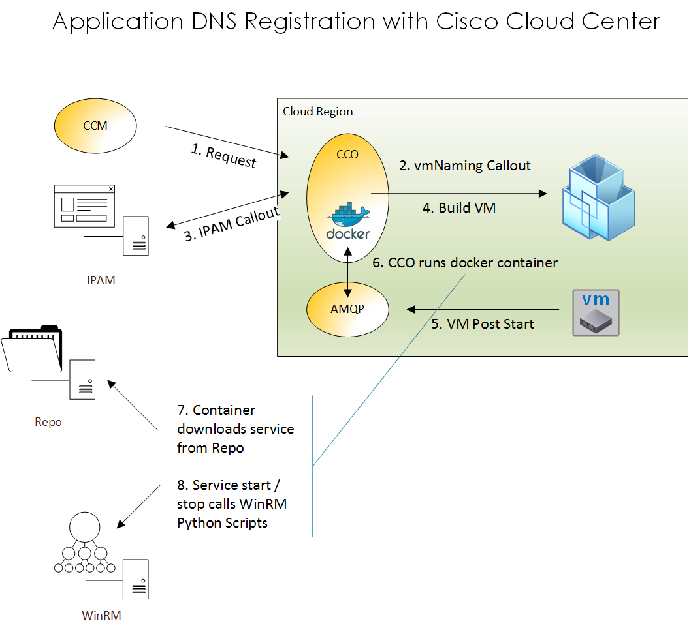

## Synopsis

This is a lifecycle script intended to be ran as an External Initialization, VM Post-Start script, and VM Post-Terminate script.

It leverages python winrm to call Powershell commands to add and remove DNS records during the lifecycle.

## Motivation

This project is the result of the week spent at the Cisco Cloud Center partner rotation. Special thanks to the BU for making this time available.

## Installation

You will need to enable WinRm on the winrmserver.  This implementation is **NOT SECURE**, and should not be used in production.

Copy the ps1 files onto your winrm server, and the service.sh file onto your local repo.

You will need to set the following properties
- winrmhost = winrm.corp.local
- winrmuser = svc.winrm@corp.local - Will need to find the right permissions.  I used a domain admin account to test the application
- winrmpassword = There is an issue with the password type with external actions.  I had to use string to make this work
- dnszone = corp.local

Automatically derived in script
- hostname = Is derived from my vmNaming callout, using a custom property called hostname
- ipaddress = derived from the environment values

Winrm was setup as basic authentication and allow the *CCO as an allowed host*.

## Contributors

Many great people helping out.

## License

Provided as is, no warranty implied or provided.
